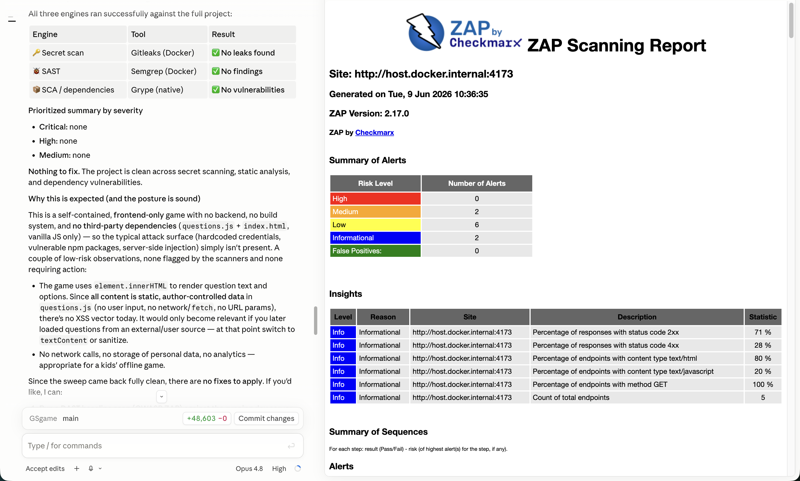

# vibe-secguard

A Claude Code plugin that brings **DevSecOps to vibe-coding**. It silently
scans every file Claude writes or edits and feeds any security findings back to
Claude so they get fixed on the fly — plus on-demand dependency and dynamic
scans.

> ### ⚠️ Platform: Claude Desktop for **macOS** only (as of now)
> This tool is built and tested **exclusively for Claude Desktop on macOS** at this
> stage. It relies on macOS + **Docker Desktop for Mac** behaviour (e.g. the
> `host.docker.internal` networking the DAST scan uses). Linux and Windows are **not
> yet supported** — contributions welcome.

| Stage | What | OSS tool | When it runs |
|-------|------|----------|--------------|
| **Secrets** | Hardcoded keys/tokens/passwords | **Gitleaks** + built-in regex net | every `Write`/`Edit` |
| **SAST** | Insecure code patterns | **Semgrep** (`--config auto`) | every `Write`/`Edit` of source files |
| **SCA** | Vulnerable dependencies | **Trivy** (fallback **Grype**) | when a manifest/lockfile changes |
| **DAST** | Live-app attack surface | **OWASP ZAP** baseline | on demand via `/dast` |

Findings are **non-blocking** (warn mode): edits go through, but Claude sees the
issues as feedback and can fix them immediately.

## What it looks like



*Left: the static sweep (`/secscan`) reporting a clean Secrets/SAST/SCA result with a prioritized summary. Right: a real OWASP ZAP baseline report from `/dast` against the running app (`host.docker.internal:4173`), showing the Medium/Low alert breakdown.*

## How it works

- A `PostToolUse` hook (`scripts/scan_file.sh`) fires after `Write`/`Edit`/`MultiEdit`/`NotebookEdit`.
- It runs the relevant fast scanners on **just the changed file** and returns
  findings via `hookSpecificOutput.additionalContext`.
- Heavier scans (`/secscan` whole-repo, `/dast` live app) are slash commands.

## Zero-install by design

Every scanner runs through a **pinned Docker image** if the native binary isn't
present, so the only hard requirement is Docker. If you also install the native
binaries (`brew install semgrep gitleaks trivy`) they're used automatically and
run faster (no container start-up). The built-in regex secret scanner works even
with no Docker and no tools.

> Check your environment any time with **`/secguard-doctor`**.

## Commands

- `/secscan [path]` — full project Secrets + SAST + SCA sweep, prioritized summary.
- `/dast [url]` — OWASP ZAP baseline against the running app (auto-detects the dev-server port; pass a URL to override).
- `/secguard-doctor` — show which scanners are active and how to enable the rest.

## Requirements

- **macOS** with **Claude Desktop** (the only supported platform right now).
- **[Docker Desktop for Mac](https://www.docker.com/products/docker-desktop/)** —
  installed **and running**. This is the one hard dependency; every scanner runs
  from a pinned Docker image, and the `/dast` scan reaches your app via Docker
  Desktop's `host.docker.internal`.
  *(Optional: `brew install semgrep gitleaks trivy` for faster native scans — auto-detected.)*
- **Python 3** and **bash** — both ship with macOS.

## Install

One command — works in every Claude Code environment:

```bash
git clone https://github.com/billhoph/vibe-secguard.git
cd vibe-secguard
./install.sh        # wires the hook + commands into ~/.claude
```

Then **open the `/hooks` menu once (or restart Claude Code)** so the config
watcher loads the new hook. Verify with `/secguard-doctor`.

To remove it later: `./uninstall.sh`.

> `install.sh` is idempotent and path-portable — it derives its own location,
> merges (never clobbers) your existing `~/.claude/settings.json`, and installs
> the three slash commands. Honors `CLAUDE_CONFIG_DIR` if you set it.

## Configuration

Override the pinned Docker image tags via environment variables in your
`settings.json` if you want different versions:

```
SECGUARD_SEMGREP_IMAGE, SECGUARD_GITLEAKS_IMAGE,
SECGUARD_TRIVY_IMAGE,   SECGUARD_ZAP_IMAGE
```

DAST reports are written to `.secguard/` in your project (add it to `.gitignore`).

## Notes & limitations

- The per-edit SAST uses Semgrep's `auto` config; first Docker run pulls rules.
- DAST baseline is passive + spider only (`-I -m 2 -T 5`) to stay quick and safe;
  it does **not** perform active attacks. Only scan apps you are authorized to test.
- On macOS/Windows the ZAP container reaches your localhost via `host.docker.internal`;
  on Linux a `host-gateway` mapping is added automatically.
